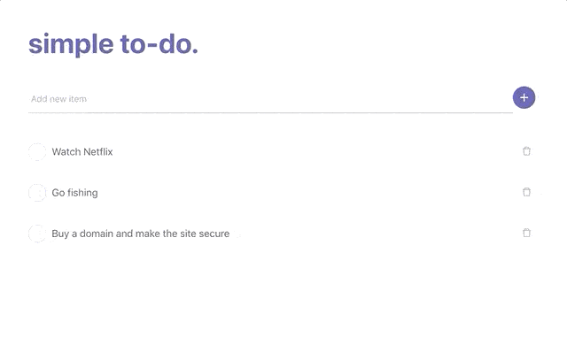

# Simple To-do
A simple to-do application using React and Node.js.

**Technologies used;**
- React with Redux, ~~Redux Thunk~~ updated with Redux Saga
- Node.js with Express
- Docker for containerization
- AWS Elastic Beanstalk
- MongoDB for database with Mongoose

